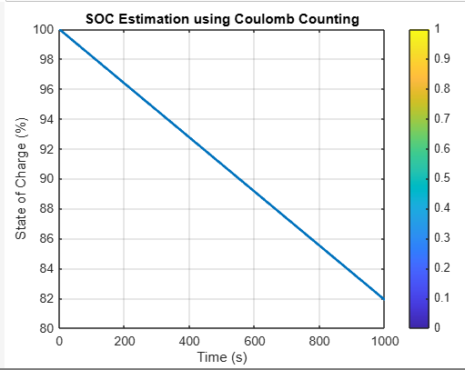

# Li-Ion-Battery-Modeling-and-Simulation-using-MATLAB-Simulink-for-Electric-Vehicles
This project models a Li-ion battery using MATLAB Simulink, focusing on SOC estimation via Coulomb counting and EV drive cycle simulation. It demonstrates BMS fundamentals and real-time simulation for electric vehicle applications.

# 🔋 Lithium-Ion Battery Modeling using MATLAB & Simulink

This project demonstrates the modeling and simulation of a **Lithium-Ion Battery** using MATLAB/Simulink. It focuses on a 1RC equivalent circuit model of a Li-ion battery cell with an internal resistance and transient response network. Additionally, the model estimates the **State of Charge (SOC)** using the **Coulomb Counting method**.

---

## 📌 Project Objectives

- 📐 Model a single Li-ion cell using 1RC electrical equivalent circuit
- ⚡ Simulate voltage response during load conditions
- 🔋 Estimate SOC (State of Charge) over time
- 🚘 Build a scalable battery pack model for EV applications

---

## 🛠️ Tools & Technologies

- MATLAB R2021b+
- Simulink
- Simscape & Simscape Electrical

- ## 🔍 Model Overview

The model includes:
- **Open Circuit Voltage Source (Voc)**
- **Internal Resistance (Rs)**
- **RC Network (R1-C1) to capture dynamic behavior**
- **Current source as load**
- **Voltage measurement and SOC logic**

The model simulates how the terminal voltage and SOC decrease over time when the battery is discharged.

---

## 📊 Output Samples

---

## 🧠 Future Improvements

- Add Kalman Filter for SOC estimation  
- Thermal modeling of the battery  
- BMS fault condition simulations  
- Parameterization for different chemistries (e.g. LiFePO4)

---

## 📦 How to Run the Project

1. Open MATLAB
2. Run `battery_parameters.m` to initialize values
3. Open and simulate `battery_sim.slx`
4. View SOC and Voltage graphs on Scope

---

## 👨‍💻 Author

**Rohit Kumar Rai**  
*Automotive Software & Model-Based Design Enthusiast*  
